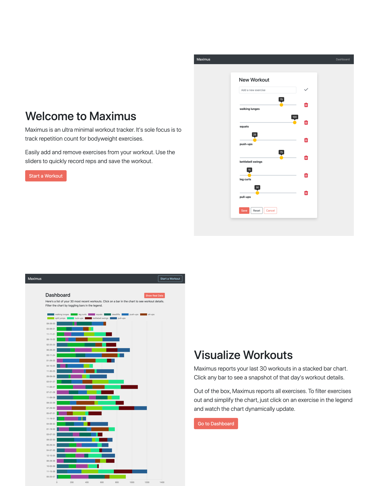

# [maximus](https://maximus-dtjv.netlify.app)

An ultra minimal workout tracker. (**[demo](https://maximus-dtjv.netlify.app)**)

## Features

- 📱 Access a responsive, mobile-first UI design
- 💪 Create a workout with up to 10 exercises
- ⚙️ Add and remove exercises to customize your workout
- ✏️ Easily track reps using a slider
- 📊 Visualize the last 30 workouts in a stacked bar chart
- 🦄 See the rainbow of colors for a randomly generated set of workouts

## License

The source code is available under the [MIT license](LICENSE).
